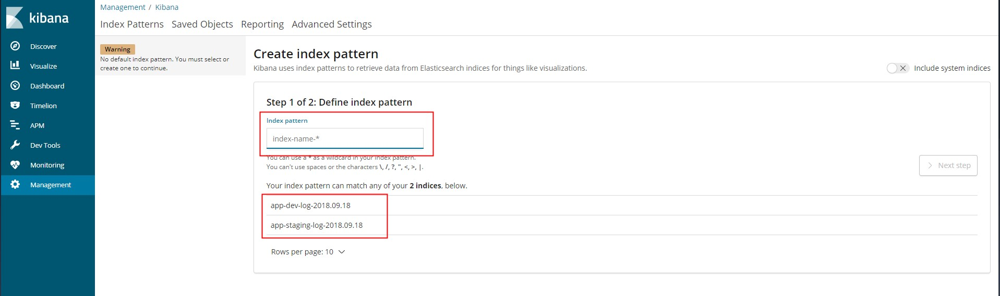
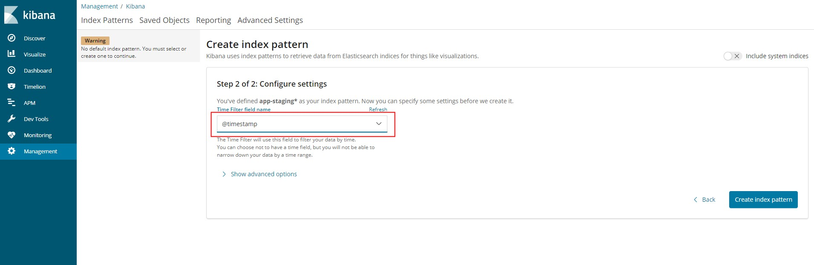
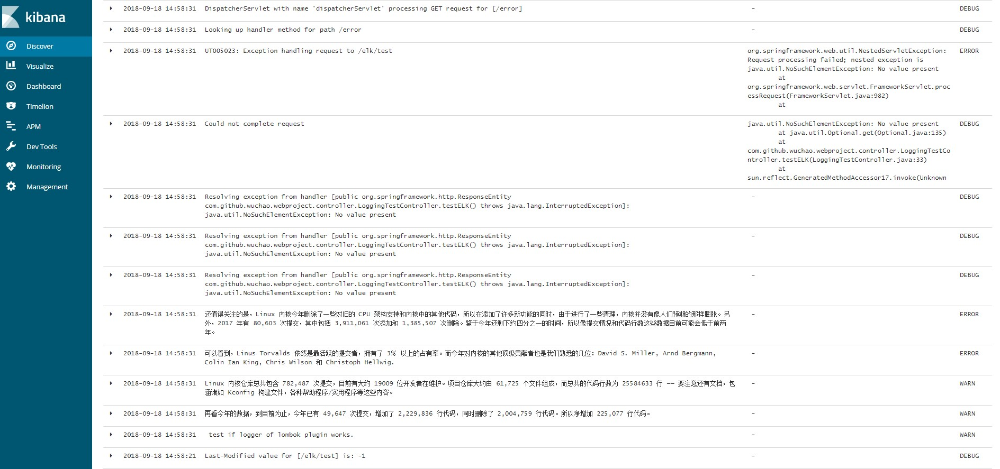
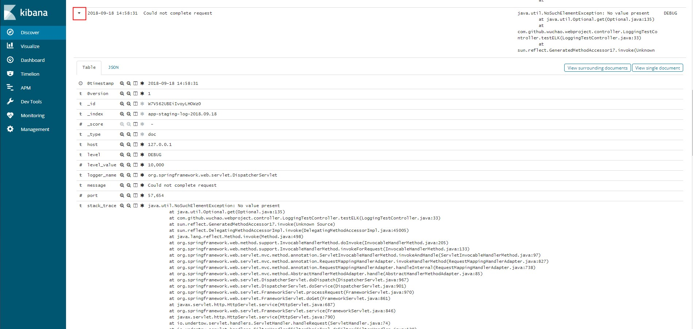
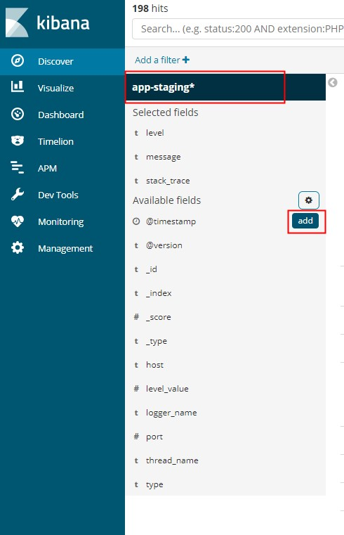

## Windows 服务器配置 ELK

ELK 是 Elasticsearch、Logstash、Kibana 三大开源框架首字母大写简称，也被成为 Elastic Stack。部署时，这三个框架的版本相互要匹配，并且也要和项目中使用的 spring-data-elasticsearch、elasticsearch 依赖的版本相匹配。

spring data elasticsearch 对应 elasticsearch 版本：

| spring data elasticsearch | elasticsearch |
| :-----------------------: | :-----------: |
|           3.2.x           |     6.5.0     |
|           3.1.x           |     6.2.2     |
|           3.0.x           |     5.5.0     |
|           2.1.x           |     2.4.0     |
|           2.0.x           |     2.2.0     |
|           1.3.x           |     1.5.2     |

下面是一个可行的依赖配置（spring-boot 版本是：2.0.5.RELEASE，服务器部署的 ELK 版本是：6.5.0）：
> [ElasticSearch6.5.0【Java客户端之TransportClient】](https://www.cnblogs.com/LUA123/p/9967638.html#top)

##### 1. 使用 RestHighLevelClient
依赖：
``` 
compile "org.springframework.data:spring-data-elasticsearch:3.2.2.RELEASE"
compile "org.elasticsearch:elasticsearch:6.5.0"
compile "net.logstash.logback:logstash-logback-encoder:5.2"
``` 

初始化：
``` 
// RestHighLevelClient client;
```

##### 2. 使用 TransportClient
依赖：
```
compile "org.elasticsearch:elasticsearch:6.5.0"
compile("org.elasticsearch.client:transport:6.5.0") {
    exclude group: 'org.elasticsearch.plugin', module: 'transport-netty4-client'
}
compile 'org.elasticsearch.plugin:transport-netty4-client:6.5.0'
compile "net.logstash.logback:logstash-logback-encoder:5.2"
```

初始化：
``` 
@Value("${elasticsearch.cluster.name}")
private String elasticsearchClusterName;

@Value("${elasticsearch.cluster.host}")
private String elasticsearchClusterHost;

private TransportClient transportClient;

private AdminClient adminClient;

@PostConstruct
public void init() throws UnknownHostException {
    Settings settings = Settings.builder()
            .put("cluster.name", elasticsearchClusterName)
            // 自动嗅探整个集群的状态，把集群中其他 ES 节点的 IP 添加到本地的客户端列表中
            .put("client.transport.sniff", true)
            .build();
    transportClient = new PreBuiltTransportClient(settings)
            // 添加 IP，至少一个，其实一个就够了，因为添加了自动嗅探配置
            .addTransportAddress(new TransportAddress(InetAddress.getByName(elasticsearchClusterHost), 9300));
    adminClient = transportClient.admin();
}
```

启动如果遇到下面异常：
 ```
Failed to instantiate [org.elasticsearch.client.transport.TransportClient]: Factory method 'elasticsearchClient' threw exception; nested exception is java.lang.IllegalStateException: availableProcessors is already set to [4], rejecting [4]
```
参考 [elasticsearch5.6.1.集成springboot 遇到的坑](https://blog.csdn.net/sinat_29899265/article/details/81772037) 解决方法。

> 实际部署时，视情况将下面示例中的 localhost 和 localhost 改成实际的服务器 IP 地址。

### 项目里面配置 Logback 日志输出

> 参考：[https://github.com/logstash/logstash-logback-encoder](https://github.com/logstash/logstash-logback-encoder)

配置 logback-spring.xml

```
<?xml version="1.0" encoding="UTF-8"?>

<configuration scan="true" scanPeriod="60 seconds">

    <include resource="org/springframework/boot/logging/logback/base.xml"/>
    <timestamp key="timestamp" datePattern="yyyy-MM-dd HH:mm:ss"/>
    <property name="LOG_HOME" value="/var/log/logging"/>

    <!-- 日志导出到本地 -->
    <appender name="FILE" class="ch.qos.logback.core.rolling.RollingFileAppender">
        <rollingPolicy class="ch.qos.logback.core.rolling.TimeBasedRollingPolicy">
            <fileNamePattern>${LOG_HOME}/app.%d{yyyy-MM-dd}.log</fileNamePattern>
            <maxHistory>7</maxHistory>
        </rollingPolicy>
        <encoder>
            <charset>utf-8</charset>
            <Pattern>%d %-5level [%thread] %logger{0}: %msg%n</Pattern>
        </encoder>
        <triggeringPolicy class="ch.qos.logback.core.rolling.SizeBasedTriggeringPolicy">
            <!-- 最大 5MB，超过最大值，会重新建一个文件-->
            <maxFileSize>5MB</maxFileSize>
        </triggeringPolicy>
    </appender>

    <!-- 日志导出到 Logstash -->
    <appender name="STASH_TCP_STAGING" class="net.logstash.logback.appender.LogstashTcpSocketAppender">
        <!-- 与服务器上 logstash 配置的 port 一致，且 host 为 logstash 所在服务器 -->
        <destination>localhost:4561</destination>
        <!-- encoder is required -->
        <encoder charset="UTF-8" class="net.logstash.logback.encoder.LogstashEncoder"/>
    </appender>
    <appender name="ASYNC_STASH_TCP_STAGING" class="ch.qos.logback.classic.AsyncAppender">
        <discardingThreshold>0</discardingThreshold>
        <queueSize>256</queueSize>
        <appender-ref ref="STASH_TCP_STAGING"/>
    </appender>

    <!-- 日志导出到 Logstash -->
    <appender name="STASH_TCP_PROD" class="net.logstash.logback.appender.LogstashTcpSocketAppender">
        <!-- 与服务器上 logstash 配置的 port 一致，且 host 为 logstash 所在服务器 -->
        <destination>localhost:4562</destination>
        <!-- encoder is required -->
        <encoder charset="UTF-8" class="net.logstash.logback.encoder.LogstashEncoder"/>
    </appender>
    <appender name="ASYNC_STASH_TCP_PROD" class="ch.qos.logback.classic.AsyncAppender">
        <discardingThreshold>0</discardingThreshold>
        <queueSize>256</queueSize>
        <appender-ref ref="STASH_TCP_PROD"/>
    </appender>

    ...
    ...
    ...

    <!-- 本地开发环境 -->
    <springProfile name="dev">
        <root level="DEBUG">
            <appender-ref ref="FILE"/>
            <appender-ref ref="CONSOLE"/>
        </root>
    </springProfile>

    <!-- 线上测试环境 -->
    <springProfile name="staging">
        <root level="INFO">
            <appender-ref ref="FILE"/>
            <appender-ref ref="ASYNC_STASH_TCP_STAGING"/>
        </root>
    </springProfile>

    <!-- 线上生产环境 -->
    <springProfile name="prod">
        <root level="INFO">
            <appender-ref ref="FILE"/>
            <appender-ref ref="ASYNC_STASH_TCP_PROD"/>
        </root>
    </springProfile>

</configuration>
```

### 安装 ElasticSearch（v6.5.0）

> [Download Elasticsearch](https://www.elastic.co/cn/downloads/elasticsearch)

启动：运行 `bin\elasticsearch.bat` (or `bin/elasticsearch` on Linux)。

浏览器打开 http://127.0.0.1:9200， 显示如下内容，说明启动成功。

```
{
  "name" : "Zyx4P_V",
  "cluster_name" : "elasticsearch",
  "cluster_uuid" : "HwFA-_3wRXGz9Epx3IOsFQ",
  "version" : {
    "number" : "6.5.0",
    "build_flavor" : "default",
    "build_type" : "zip",
    "build_hash" : "816e6f6",
    "build_date" : "2018-11-09T18:58:36.352602Z",
    "build_snapshot" : false,
    "lucene_version" : "7.5.0",
    "minimum_wire_compatibility_version" : "5.6.0",
    "minimum_index_compatibility_version" : "5.0.0"
  },
  "tagline" : "You Know, for Search"
}
```

查看 elasticsearch 集群状态信息： `http://127.0.0.1:9200/_cluster/health?pretty=true` 。

```
{
  "cluster_name" : "elasticsearch",
  "status" : "yellow",
  "timed_out" : false,
  "number_of_nodes" : 1,
  "number_of_data_nodes" : 1,
  "active_primary_shards" : 6,
  "active_shards" : 6,
  "relocating_shards" : 0,
  "initializing_shards" : 0,
  "unassigned_shards" : 5,
  "delayed_unassigned_shards" : 0,
  "number_of_pending_tasks" : 0,
  "number_of_in_flight_fetch" : 0,
  "task_max_waiting_in_queue_millis" : 0,
  "active_shards_percent_as_number" : 54.54545454545454
}
```

查看 elasticsearch 索引信息： `http://127.0.0.1:9200/_cat/indices?v`。

### 安装 Logstash（v6.5.0）

> [Download Logstash](https://www.elastic.co/cn/downloads/logstash)

打开 `config/logstash.yml` 配置文件，修改 host 和 port 。

```
http.host: "127.0.0.1"
http.port: 9601
```

在 logstash 的 config 目录下新建配置文件，文件名命名为 `logstash.conf`，配置内容如下。

配置 logstash.config：

```
input {

  kafka {
    bootstrap_servers => "127.0.0.1:9092"
    topics => "test"
    consumer_threads => 1
    decorate_events => true
    codec => "json"
    auto_offset_reset => "latest"
  }

}

output {

  elasticsearch {
    hosts => ["127.0.0.1:9200"]
    index => "app-staging-log-%{+YYYY.MM.dd}"
  }

}
```

多个 input 和 多个 output 的配置写法（下面的注释语法可能不正确，只是为了说明加上去的）：

```
input {

  tcp {
    host => "127.0.0.1"
    port => 4561
    codec => "json"
    type => "app-staging-tcp"
  }

  tcp {
    host => "127.0.0.1"
    port => 4562
    codec => "json"
    type => "app-prod-tcp"
  }

  kafka {
    bootstrap_servers => "127.0.0.1:9092"
    topics => "app-staging"
    consumer_threads => 1
    decorate_events => true
    codec => "json"
    auto_offset_reset => "latest"
    type => "app-staging-kafka"
  }

  kafka {
    bootstrap_servers => "127.0.0.1:9092"
    topics => "app-prod"
    consumer_threads => 1
    decorate_events => true
    codec => "json"
    auto_offset_reset => "latest"
    type => "app-prod-kafka"
  }

  redis {
    host => "127.0.0.1"
    port => 6379
    password => "app-redis"
    db => 2
    data_type => "list"
    key => "app-staging"
    type => "app-staging-redis"
  }

}

filter {
  grok {
    match => {
      "message" => [
        "%{DATA:logType}\:%{GREEDYDATA:user}<->%{GREEDYDATA:module}<->%{GREEDYDATA:method}<->%{GREEDYDATA:action}<->%{GREEDYDATA:description}<->%{GREEDYDATA:json}",
        "%{DATA:logType}\:%{GREEDYDATA:user}<->%{GREEDYDATA:moudle}<->%{GREEDYDATA:method}<->%{GREEDYDATA:action}<->%{GREEDYDATA:description}",
        "%{DATA:logType}\:%{GREEDYDATA:exception}",
        "%{GREEDYDATA:[@metadata][mes]}"
      ]
    }
    remove_field => "message"
  }

  if [logType] not in ["userLog", "cacheLog"] {
    mutate {
      replace => {"logType" => "other"}
    }
  }
}

output {

  if [type] == "app-staging-tcp" {
    elasticsearch {
      hosts => ["127.0.0.1:9200"]
      // ElasticSearch 索引形式
      index => "app-staging-tcp-%{+YYYY.MM.dd}"
    }
  }

  if [type] == "app-staging-kafka" {
    elasticsearch {
      hosts => ["127.0.0.1:9200"]
      index => "app-staging-log-%{+YYYY.MM.dd}"
    }
  }

  if [type] == "app-prod-kafka" {
    elasticsearch {
      hosts => ["127.0.0.1:9200"]
      index => "app-prod-log-%{+YYYY.MM.dd}"
    }
  }

  if [type] == "app-staging-redis" {
    elasticsearch {
      hosts => ["127.0.0.1:9200"]
      index => "app-staging-log-%{+YYYY.MM.dd}"
    }
  }

}
```

> [logstash grok 分割匹配日志](https://www.cnblogs.com/shantu/p/4598875.html)

启动 logstash。

```
logstash.bat -f ../config/logstash.conf --debug
```

查看 logstash 启动信息：浏览器打开 `http://127.0.0.1:9601/?pretty=true` 。

```
{
  "host" : "PC180495",
  "version" : "6.5.0",
  "http_address" : "127.0.0.1:9601",
  "id" : "febb58dd-cadd-4050-9510-5229ff1cc0d5",
  "name" : "PC180495",
  "build_date" : "2018-11-09T19:43:40+00:00",
  "build_sha" : "4b3a404d6751261d155458c1a8454a22167b1954",
  "build_snapshot" : false
}
```

#### 在 Windows 端安装 logstash 提示错误

输入 `logstash.bat -f ../config/logstash.conf --debug` 命令后出现以下错误

```
错误：找不到或无法加载主类 Files\Java\jdk1.7.0_80\lib;C:\Program
```

解决方式如下：在 logstash 安装目录中找到 `bin\logstash.bat`，打开，找到如下内容

```
%JAVA% %JAVA_OPTS% -cp %CLASSPATH% org.logstash.Logstash %*
```

将 %CLASSPATH% 改为 "%CLASSPATH%" 即可解决。

> 参考：[logstash 启动报无法找到主类解决方案](https://www.cnblogs.com/sbj-dawn/p/8549369.html)

#### 启动 logstash 如果报如下错：

```
logstash.config.sourceloader] No configuration found in the configured sources.
```

则修改 `D:\ELK\logstash-6.5.0-kafka\config` 目录下的 `pipelines.yml` 配置文件如下：

```
- pipeline.id: another_test
    path.config: "D:\ELK\logstash-6.5.0-kafka\config\logstash.config"
```

重启 logstash 即可。

> 参考：[Multiple Pipelines doesn't seem to work with Windows OS](https://github.com/elastic/logstash/issues/9144)

### 安装 Kafka 做缓冲队列（也可以使用 Redis）

> [Quickstart](https://kafka.apache.org/quickstart)
>
> Windows 脚本在 bin/windows 目录下。

kafka 配置文件（./config/server.properties）说明

```
listeners=PLAINTEXT://127.0.0.1:9092

# kafka 存放数据的路径。这个路径并不是唯一的，可以是多个，路径之间只需要使用逗号分隔即可；
# 每当创建新 partition 时，都会选择在包含最少 partitions 的路径下进行。
log.dirs=E://Kafka//logs

# 数据存储的最大时间，超过这个时间会根据 log.cleanup.policy 设置的策略处理数据
log.retention.hours=168

# Zookeeper connection string (see zookeeper docs for details).
# This is a comma separated host:port pairs, each corresponding to a zk
# server. e.g. "127.0.0.1:3000,127.0.0.1:3001,127.0.0.1:3002".
# You can also append an optional chroot string to the urls to specify the
# root directory for all kafka znodes.
zookeeper.connect=localhost:2181
```

以上演示，ZooKeeper 和 Kafka 都只部署了一个节点。

#### 在 Windows 端安装 kafka 提示错误

输入 `kafka-server-start.bat ../../config/server.properties` 命令后出现以下错误

```
错误：找不到或无法加载主类 Files\Java\jdk1.7.0_80\lib;C:\Program
```

解决方式如下：在 kafka 安装目录中找到 bin\windows 目录中的 `kafka-run-class.bat` ，打开，找到如下内容

```
set COMMAND=%JAVA% %KAFKA_HEAP_OPTS% %KAFKA_JVM_PERFORMANCE_OPTS% %KAFKA_JMX_OPTS% %KAFKA_LOG4J_OPTS% -cp %CLASSPATH% %KAFKA_OPTS% %*
```

为 %CLASSPATH% 加上双引号，

```
set COMMAND=%JAVA% %KAFKA_HEAP_OPTS% %KAFKA_JVM_PERFORMANCE_OPTS% %KAFKA_JMX_OPTS% %KAFKA_LOG4J_OPTS% -cp "%CLASSPATH%" %KAFKA_OPTS% %*
```

> 参考：[在 Windows 端安装 kafka 提示错误: 找不到或无法加载主类 的解决方案](https://blog.csdn.net/u012931508/article/details/55211390)

### 安装 Kibana（v6.5.0）

> [Download Kibana](https://www.elastic.co/cn/downloads/kibana)

Kibana 解压目录下的 config/kibana.yml 配置文件中关于 ES 的配置：

```
# ES 地址
elasticsearch.url: "http://127.0.0.1:9200"
```

如果 ES 部署在其他服务器，要同步修改这里的配置

启动：运行 `bin/kibana` (or `bin\kibana.bat` on Windows)。

### Kibana 的汉化

> 参考: [https://github.com/anbai-inc/Kibana_Hanization](https://github.com/anbai-inc/Kibana_Hanization)

### 代码测试

```
package com.github.wuchao.webproject.controller;

import org.slf4j.LoggerFactory;
import org.springframework.http.ResponseEntity;
import org.springframework.web.bind.annotation.GetMapping;
import org.springframework.web.bind.annotation.RestController;

import java.util.Optional;

@RestController
public class LoggingTestController {

    private static final org.slf4j.Logger LOGGER = LoggerFactory.getLogger(LoggingTestController.class);

    /**
     * 生成日志测试
     */
    @GetMapping("/elk/test")
    public ResponseEntity testELK() throws InterruptedException {
        while (true) {
            Thread.sleep(10000);
            LOGGER.warn("logstash 采集与清洗数据到 elasticsearch 案例实战");
        }
    }

}
```

在 debug 模式启动的 logstash 的控制台可以看到输出的信息，这时浏览器打开 localhost:5601 打开 Kibana 查看日志 。

先进入 Management -> Kibana -> Create index pattern，如下图所示。



输入能够匹配已有的索引名称的索引正则，如“app-staging\*”,点击下一步。



选择 `@Timestamp`，点击下一步。

回到首页，如果项目中有日志输出，即可看到日志。首页右上角可以设置查看某一时间范围内的日志，还可以设置日志刷新频率等。



点击每条日志左上角的三角形按钮可以查看日志的详细信息。



日志列表左边的筛选处还可以控制显示其他日志和日志列表显示的属性。


